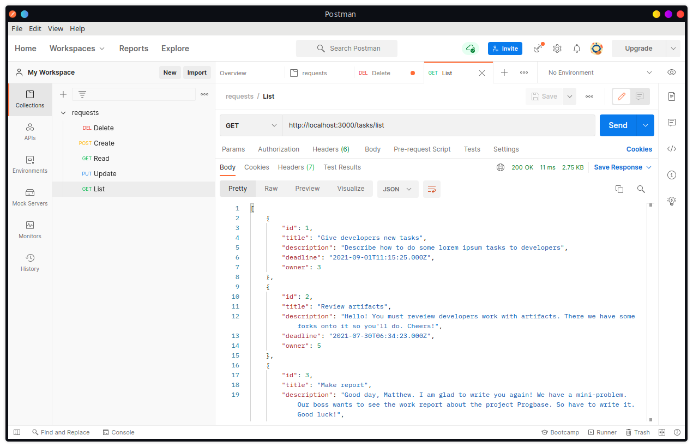
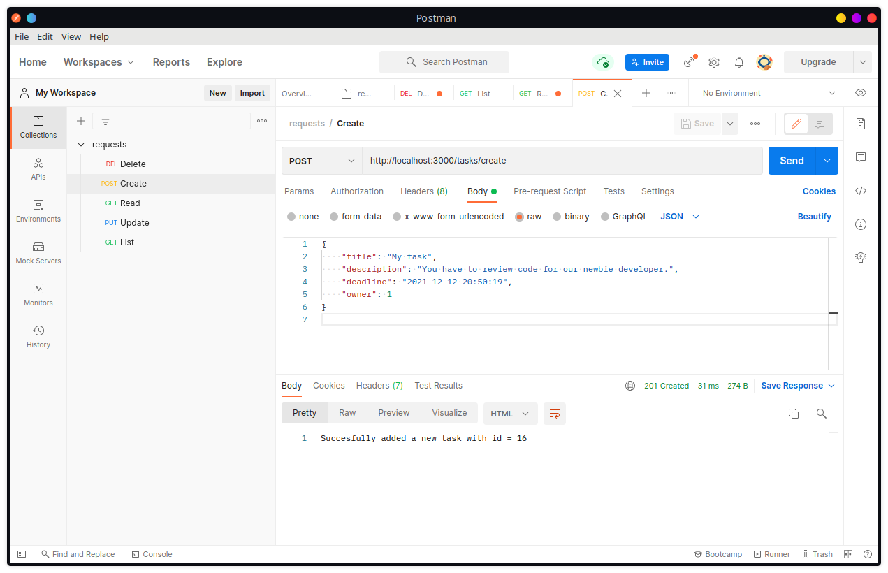
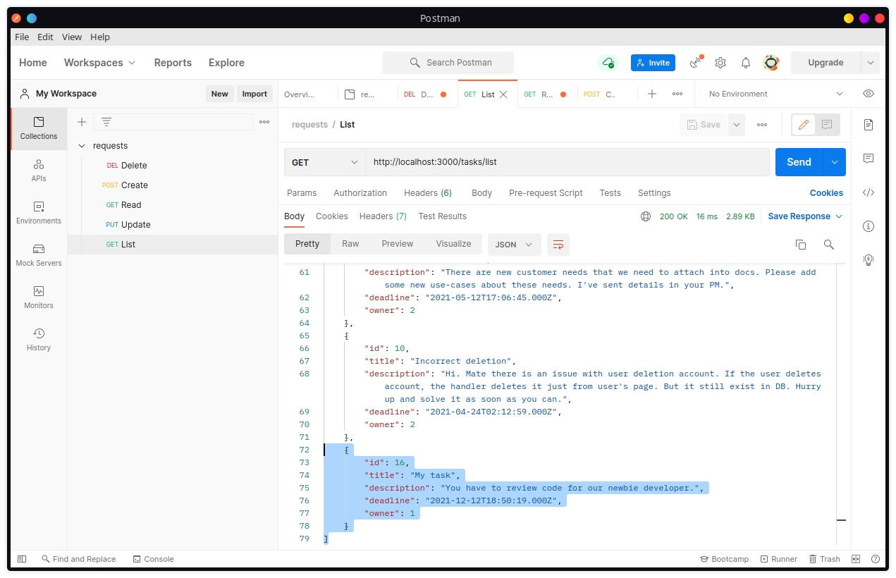
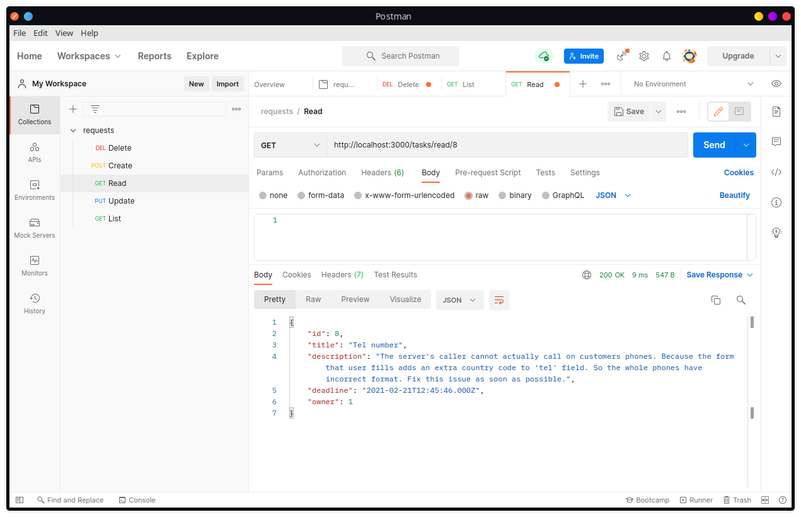
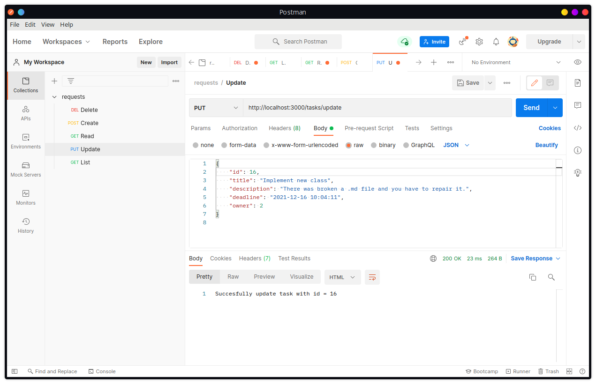
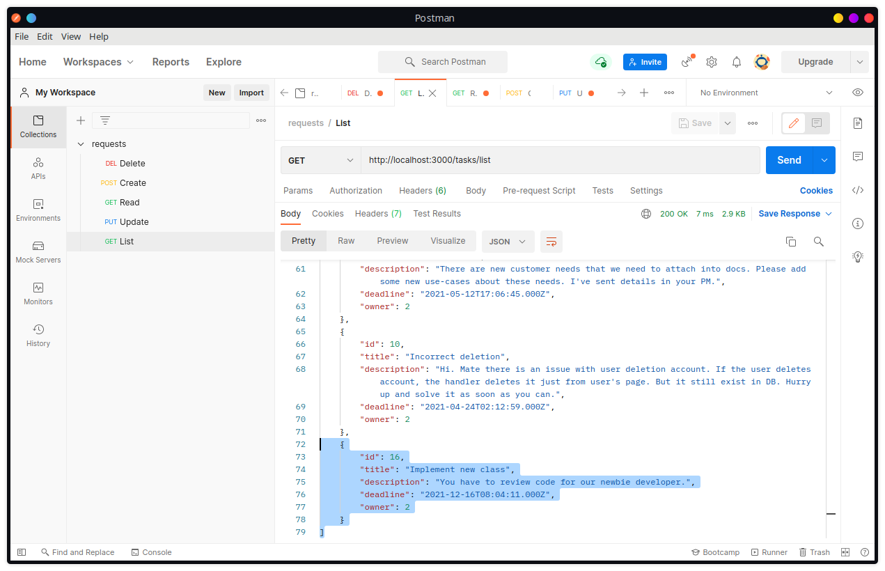
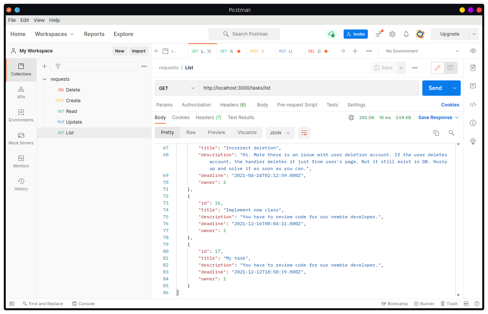
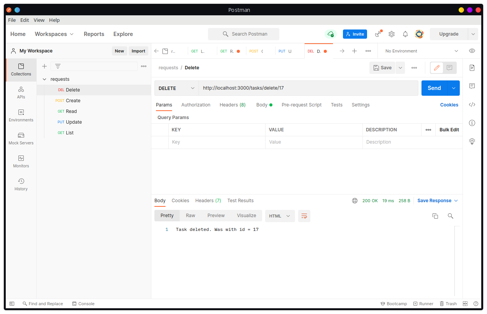

# Тестування працездатності системи

*У цьому розділі демонструється запити та результати тестування розробленого ПЗ за допомогою додатку Postman - HTTP клієнта для тестування серверного API.*

## Відображення всіх сутностей

## Додавання сутності (CREATE)

### Запит

### Результат

## Зчитування сутності (READ)

### Результат

## Оновлення сутності (UPDATE)

### Запит

### Результат

## Видалення сутності (DELETE)

### Початковий стан списку

### Запит

### Результат

